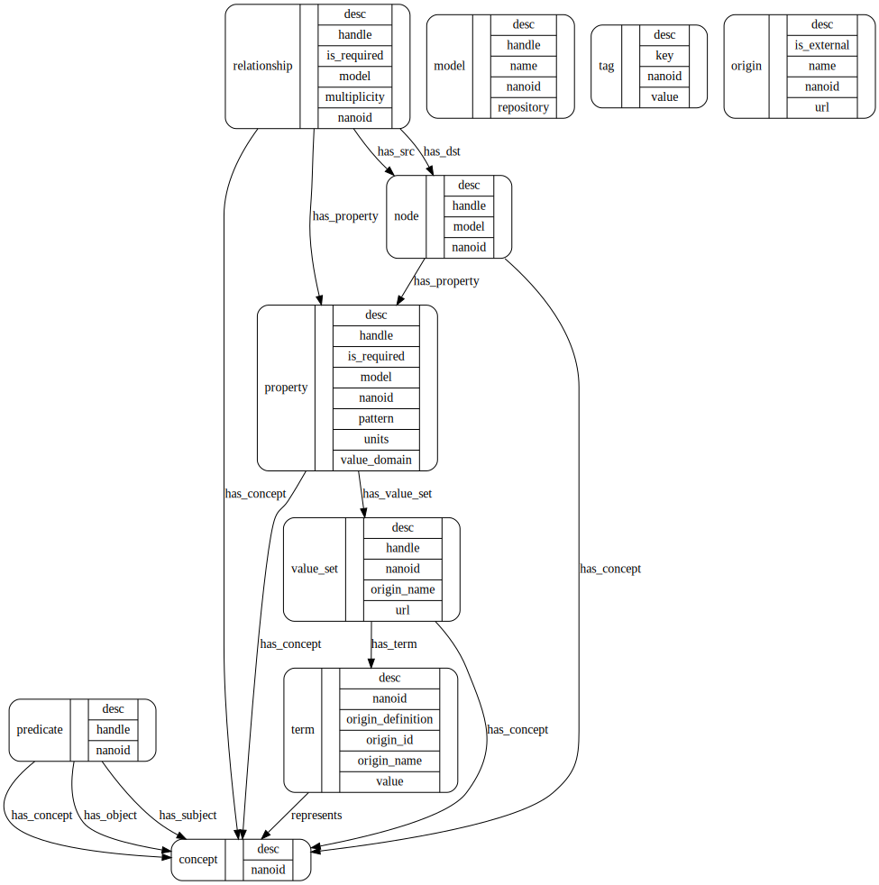

# Metamodel Database

The metamodel database (MDB) records
- node/relationship/property structure of models;
- the official local vocabulary - terms that are employed in the backend data system;
- synonyms for local vocabulary mapped from external standards; and
- the value sets for properties with enumerated value domains, and data types for other properties.

The production instance of MDB contains a practical representation of a data model, in that it records the curated external terminology mappings and official sets of valid terms for each relevant property. In this way, the MDB is an extension of the [MDF](https://github.com/CBIIT/bento-mdf) for any model it contains.

As the central location for official mappings to external vocabularies, the MDB can (should) be used as part of software modules that convert between the data physically stored in the production database and external standards. For example, an API known as the Simple Terminology Service [STS](https://github.com/CBIIT/bento-sts), using MDB as its backend, is used for simple queries about a given model and validation of incoming data.

More details about the structure and contents of MDB are given in the [bento-meta](https://github.com/CBIIT/bento-meta) repository, which houses APIS for working with the MDB in Python and Perl.

## Current Projects

The production MDB currently represents these projects:

### Models

- [Childhood Cancer Data Initiative](https://github.com/CBIIT/ccdi-model)
- [Cancer Data Service](https://github.com/CBIIT/ccdi-model)
- [Genomic Data Commons](https://github.com/CBIIT/gdc-model)
- [Integrated Canine Data Commons](https://caninecommons.cancer.gov)

### Mappings

- [Data Standards Service](https://github.com/nelsonwmoore/dss-model)

## Structure

The MDB is formulated as a [graph model](https://en.wikipedia.org/wiki/Graph_database#Labeled-property_graph). This model contains more structure than will be exposed by the Simple Terminology Service (in order to keep it Simple). Other services can be built on the DB to perform translations, add terms and mappings, create visualizations, and other functions.

The metamodel is described in a [Model Description File](./metamodel.yaml). Documents and tools for this format are at [bento-mdf](https://github.com/CBIIT/bento-mdf).



The MDB model contains the following nodes:

### Node 

A node with the label "node" in the MDB represents a model node: for example, a `Diagnosis` node. 

### Relationship

A Relationship _node_ represents a model _relationship_; for example, a model may entail a relationship `has_diagnosis` from a `Case` node to a `Diagnosis` node. To represent this in the metamodel, a Relationship node is created with `handle` = `has_diagnosis`, along with a link `has_src` to the `Case` node, and a link `has_dst` to the `Diagnosis` node. A Neo4j relationship is also created between Node nodes, with a type = `<relationship handle>`. In the example, `Case` and `Diagnosis` nodes would be linked by a `has_diagnosis` relationship.

### Property

A Property node in the MDB represents a property of a model node: for example, the `disease` property of a `Diagnosis` node. 

### Concept

A Concept node represents an intellectual concept. It is abstract, in that it has no human readable name as such; it will however have a unique ID. The Concept node can be thought of as a connecting point for sets of Terms that are identical in meaning (are _synonymous_).

### Predicate 

A Predicate node is a means for semantically relating two Concept nodes, A Predicate itself can also link to a Concept that it represents. Semantic concepts behind a predicate could be, e.g., "contains", "is a child of", "is broader than".

### Origin

An Origin node represents an entity (institution, internal project, defined standard, recognized body, public database) that defines and/or promulgates a terminology and represents it authoritatively.

### Term > Value

A Term node is an instance of encoding (a "representation") of a concept. Each Term node is linked to at least one Origin node, which represents the entity that provides the term value/code and/or the term semantics.

The value property of a Term node is the string representation of the term. This is a token that, for example, may be physically stored in a database as a datum.

### Value Set

A Value Set node aggregates (links to) a number of Term nodes that define the list of acceptable values for a property slot. The value set does not directly aggregate Concepts; it is meant to define the pragmatic set of valid representations of values for a property.

### Tag

A Tag node represents a simple key/value pair. Any other type of node can be annotated with a Tag node. For example, Concepts can have Tags that indicate the mapping_source that asserts two Properties are synonymous.

## Semantic Information in the MDB

Semantic structure (for example, hierarchical groupings of concepts, or other "facts" or "predicate" relationships), besides synonymy and value set grouping, is recorded in the MDB using the `predicate` node to link subject and object `concept` nodes.

In general, to the extent that semantic information exists, it is better to access it by external services via the relevant Origins (e.g., NCI Thesaurus). External model topologies need not be concordant with the model structure represented in the MDB. However, it can be useful to semantically annotate certain concepts within the MDB itself. In particular, parent-child, class-subclass, and more general [SKOS](https://www.w3.org/2004/02/skos/specs) annotations may be useful to have locally for terminology mapping applications.

## MDB Setup

The production MDB is a Neo4j database that is instantiated using [Liquibase changelogs](https://docs.liquibase.com/concepts/changelogs/home.html). These changelogs are generated using [bento-meta](https://github.com/CBIIT/bento-meta) scripts on [MDF representations](https://github.com/CBIIT/bento-mdf) of models and mappings.

### Setting up a New MDB Instance

1. [Install and deploy new Neo4j database](https://neo4j.com/docs/operations-manual/current/installation/). The production MDB uses Neo4j v4.4.5.
2. [Install Awesome Procedures On Cypher (APOC)](https://neo4j.com/labs/apoc/4.4/installation/) by adding APOC jar file to /plugins/ directory. The production MDB used apoc-4.4.0.6.jar which is compatible with this Neo4j version.
3. Enable APOC triggers (which are used to add nanoids to new entities) by adding an apoc.conf file to the /conf/ directory with the line: `apoc.trigger.enabled=true`.
4. [Install Liquibase CLI](https://www.liquibase.com/download).
5. [Install Neo4j Plugin for Liquibase](https://neo4j.com/labs/liquibase/docs/download/).
6. Populate database from Liquibase changelogs with the `liquibase update` command.

## Liquibase CLI Commands

These examples assume the changelog is in XML format and that Neo4j runs at the URI `bolt://localhost` with user `neo4j` and password `changeme` and should be changed to match your setup.

- Dry run: 
  ```shell
  liquibase --url jdbc:neo4j:bolt://localhost \
            --username neo4j \
            --password changeme \
            --changeLogFile changeLog.xml \
            updateSQL
  ```
- Update the database: 
  ```shell
  liquibase --url jdbc:neo4j:bolt://localhost \
            --username neo4j \
            --password changeme \
            --changeLogFile changeLog.xml \
            update
  ```

## Example Queries

- What are the nodes in the ICDC model?

  ```cypher
  match (n:node {model:"ICDC"}) return n;
  ```

- What are the nodes in the CCDI model?

  ```cypher
  match (n:node {model:"CCDI"}) return n;
  ```

- What are the acceptable values for the ICDC "body_system" property?

  ```cypher
  match (p:property {handle:"body_system", model:"ICDC"})-->(:value_set)-->(t:term) return t.value;
  ```

- Are there properties that have the same name ("handle") in both ICDC and CCDI?

  ```cypher
  match (p:property {model:"ICDC"}), (q:property {model:"CCDI"}) where p.handle=q.handle return p.handle;
  ```

- Do these properties refer to the same semantic concept, or different concepts?

  ```cypher
  match (n:property) with count(n) as ct, n.handle as handle where ct>1
  match (n:property)-[:has_concept]->(c) where n.handle=handle return n, c;
  ```